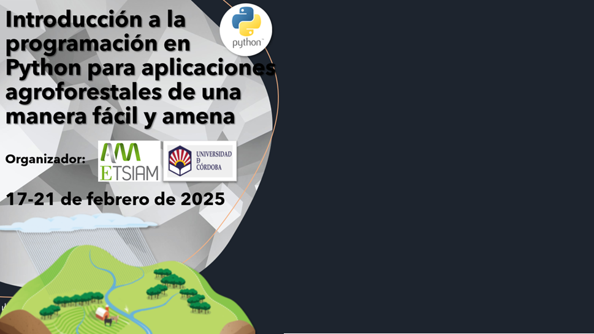

<h>El objetivo del curso es la crear una primera inmersión a la programación en Python y explicar conceptos y funciones básicas de una manera amena y accesible a alumnos sin conocimientos previos en programación. Además, este curso pretende mostrar a los alumnos la utilidad de la programación en Python, y como sabiendo unos pocos conceptos básicos pueden mejorar mucho la calidad y eficiencia de su trabajo durante sus estudios universitarios en carreras agroforestales. Todo ello intentando que el alumno perciba la programación como algo fácil y accesible. 

## Conceptos basicos

[0 - Crear un Jupyter Notebook](https://mybinder.org/v2/gh/Curso-Introduccion-Python/Curso-Introduccion-Python/HEAD?urlpath=tree/Untitled.ipynb)

[1 - Jupyter Notebooks](https://mybinder.org/v2/gh/Curso-Introduccion-Python/Curso-Introduccion-Python/HEAD?urlpath=tree/1%20-%20Jupyter%20Notebooks.ipynb)

[2 - Conceptos basicos de programacion en Python](https://mybinder.org/v2/gh/Curso-Introduccion-Python/Curso-Introduccion-Python/HEAD?urlpath=tree/2%20-%20Conceptos%20basicos%20de%20programacion%20en%20Python.ipynb )

[3 – Programacion funcional](https://mybinder.org/v2/gh/Curso-Introduccion-Python/Curso-Introduccion-Python/HEAD?urlpath=tree/3%20-%20Programacion%20funcional.ipynb)

[4 – Librerías de funciones externas](https://mybinder.org/v2/gh/Curso-Introduccion-Python/Curso-Introduccion-Python/HEAD?urlpath=tree/4%20-%20Librerias%20de%20funciones%20externas.ipynb)

[5 – Librerías de funciones externas (continuación)](https://mybinder.org/v2/gh/Curso-Introduccion-Python/Curso-Introduccion-Python/HEAD?urlpath=tree/5%20-%20Librerias%20de%20funciones%20externas%20(continuacion).ipynb)

## Ejemplos

[Ejemplo – Modelo deposito agua](https://mybinder.org/v2/gh/Curso-Introduccion-Python/Curso-Introduccion-Python/HEAD?urlpath=tree/Ejemplo%20-%20Modelo%20deposito%20agua.ipynb)

[Ejemplo – Visualizacion datos cultivos](https://mybinder.org/v2/gh/Curso-Introduccion-Python/Curso-Introduccion-Python/HEAD?urlpath=tree/Ejemplo%20-%20Visualizacion%20datos%20cultivos.ipynb)

[Ejemplo – Onda de sonido](https://mybinder.org/v2/gh/Curso-Introduccion-Python/Curso-Introduccion-Python/HEAD?urlpath=tree/Ejemplo%20-%20Onda%20de%20sonido.ipynb)

[Ejemplo – Modelo hidrologico](https://mybinder.org/v2/gh/Curso-Introduccion-Python/Curso-Introduccion-Python/HEAD?urlpath=tree/Ejemplo%20-%20Modelo%20hidrologico.ipynb)

[Ejemplo – Fill termperature data gaps](https://mybinder.org/v2/gh/Curso-Introduccion-Python/Curso-Introduccion-Python/HEAD?urlpath=tree/Ejemplo%20-%20Fill%20temperature%20data%20gaps.ipynb)

[Ejemplo – Extract raster elevation data](https://mybinder.org/v2/gh/Curso-Introduccion-Python/Curso-Introduccion-Python/HEAD?urlpath=tree/Ejemplo%20-%20Extract%20raster%20elevation.ipynb)

[Ejemplo – Extract raster coordinates](https://mybinder.org/v2/gh/Curso-Introduccion-Python/Curso-Introduccion-Python/HEAD?urlpath=tree/Ejemplo%20-%20Extract%20raster%20coordinates.ipynb)

[Ejemplo – Spatial interpolation](https://mybinder.org/v2/gh/Curso-Introduccion-Python/Curso-Introduccion-Python/HEAD?urlpath=tree/Ejemplo%20-%20Spatial%20interpolation.ipynb)

[Ejemplo – Optimal sampling](https://mybinder.org/v2/gh/Curso-Introduccion-Python/Curso-Introduccion-Python/HEAD?urlpath=tree/Ejemplo%20-%20Optimal%20Samping.ipynb)

## Ejercicios

[Ejercicios Funciones](https://mybinder.org/v2/gh/Curso-Introduccion-Python/Curso-Introduccion-Python/HEAD?urlpath=tree/Ejercicios%20Funciones.ipynb)

[Ejercicios Numpy](https://mybinder.org/v2/gh/Curso-Introduccion-Python/Curso-Introduccion-Python/HEAD?urlpath=tree/Ejercicios%20Numpy.ipynb)

[Ejercicios Pandas](https://mybinder.org/v2/gh/Curso-Introduccion-Python/Curso-Introduccion-Python/HEAD?urlpath=tree/Ejercicios%20Pandas.ipynb)

[Ejercicios Matplotlib](https://mybinder.org/v2/gh/Curso-Introduccion-Python/Curso-Introduccion-Python/HEAD?urlpath=tree/Ejercicios%20Matplotlib.ipynb)

## Cuestionarios

[Día 1](https://forms.gle/Kmd7WBdip7hzymwa7)

[Día 2](https://forms.gle/CzbAVVp2kBEGALy86)

[Día 3](https://forms.gle/otdCc4QizQ5MZB8m8)

[Día 4](https://forms.gle/3TgMxP8Riu7aCcpY6)

[Día 5](https://forms.gle/317YoMdDgB247AqEA)

&nbsp;

  

